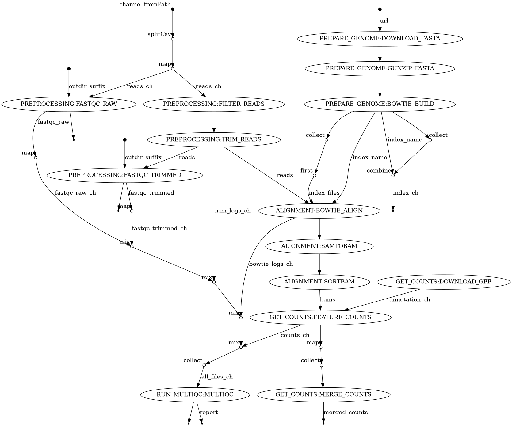

# smallRNA-pipeline

A modular and reproducible Nextflow DSL2 pipeline for preprocessing, alignment, and quantification of small RNA-seq data.

The pipeline performs:

* Raw read quality control
* Read filtering and adapter trimming
* Bowtie alignment
* BAM conversion and sorting
* Gene-level quantification with featureCounts
* MultiQC report generation

The workflow has been developed using a modular DSL2 architecture with reusable subworkflows and Docker support for reproducible execution.

---

## Pipeline Overview

```text
FASTQ
  ├── FastQC (raw reads)
  ├── Read filtering
  ├── Adapter trimming
  ├── FastQC (trimmed reads)
  ├── Bowtie alignment
  ├── SAM → BAM conversion
  ├── BAM sorting
  ├── featureCounts quantification
  ├── Count matrix merging
  └── MultiQC report
```


---

## Repository Structure

```text
.
├── modules/           # Individual Nextflow DSL2 modules
├── subworkflows/      # Higher-level workflow composition
├── data/test/         # Minimal reproducible test dataset
├── reference/         # Reference genome and annotation files
├── bin/               # Custom helper scripts
├── conf/              # Configuration files
├── main.nf            # Main workflow entry point
├── nextflow.config    # Pipeline configuration
└── environment.yml    # Conda environment definition
```

---

## Requirements

* Nextflow >= 24
* Docker

Alternatively, the pipeline can be executed using Conda environments.

---

## Installation

Clone the repository:

```bash
git clone https://github.com/ralodo93/smallRNA-pipeline.git
cd smallRNA-pipeline
```

---

## Test Run

The repository includes a minimal test dataset located in:

```text
data/test/
```

Run the test workflow with Docker:

```bash
conda create -f environment.yml
conda activate mirna
nextflow run main.nf -profile test,docker
```

This test dataset is intentionally small and designed for rapid validation of the workflow architecture.

---

## Running the Pipeline

### Using a pre-built Bowtie index

```bash
nextflow run main.nf \
    -profile docker \
    --input samplesheet.csv \
    --index reference/chr22/chr22
```

### Building a Bowtie index automatically

```bash
nextflow run main.nf \
    -profile docker \
    --input samplesheet.csv \
    --fasta_url <GENOME_FASTA_URL> \
    --index_name hg38
```

---

## Input Format

The pipeline expects a CSV samplesheet with the following structure:

```csv
sample,fastq
sample1,data/sample1.fastq.gz
sample2,data/sample2.fastq.gz
```

Required columns:

* `sample`
* `fastq`

---

# Pipeline Modules

| Step             | Tool                 |
| ---------------- | -------------------- |
| Quality control  | FastQC               |
| Read filtering   | Custom Python script |
| Adapter trimming | Cutadapt             |
| Alignment        | Bowtie               |
| BAM processing   | samtools             |
| Quantification   | featureCounts        |
| Reporting        | MultiQC              |

---

## Output Files

The pipeline generates:

* FastQC reports
* Trimmed FASTQ files
* Sorted BAM files
* featureCounts outputs
* Merged counts matrix
* MultiQC report

Typical output structure:

```text
results/
├── fastqc/
├── trimmed/
├── alignment/
├── counts/
└── multiqc/
```

---

## Workflow Design

The pipeline is implemented using:

* Nextflow DSL2
* Modular reusable processes
* Subworkflow composition
* Tuple-based metadata propagation
* Docker-enabled reproducibility
* Automatic genome index reuse/building

---

## Reproducibility

The workflow supports:

* Docker execution
* Cached execution with `-resume`
* Minimal reproducible test datasets
* Modular workflow architecture

---

---

## License

This project is licensed under the MIT License.

---
